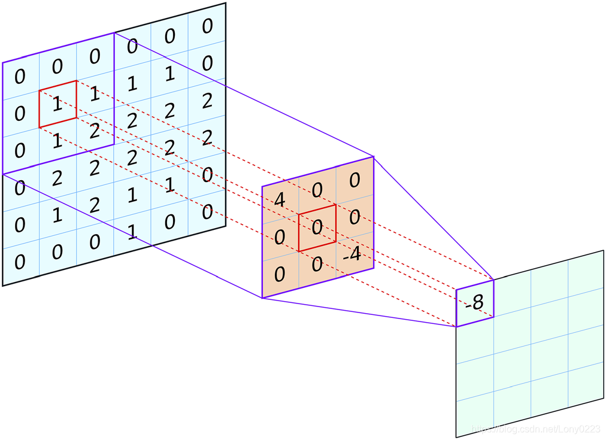
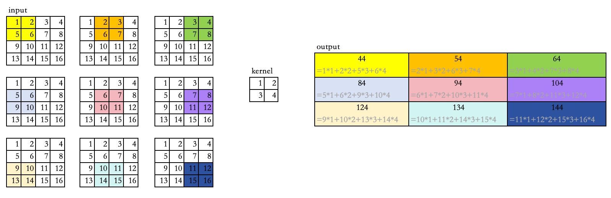
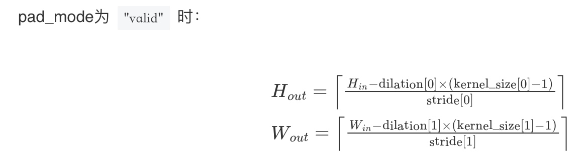
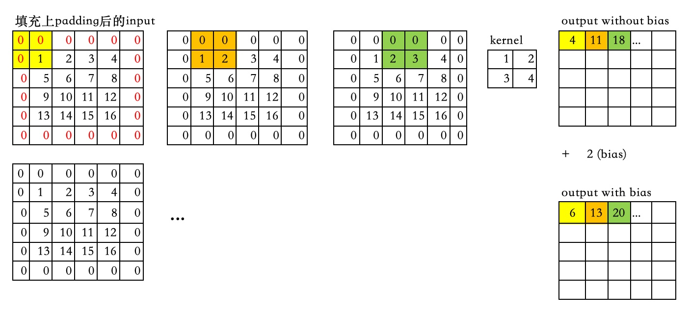
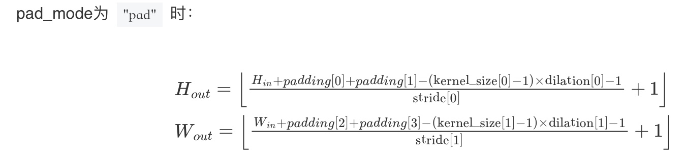

# mindspore.nn.Conv2d
**二维卷积**，通常应用于二维图像场景。卷积运算是指卷积核在图像上进行滑动，并在相应位置上进行乘加。 
```python
class mindspore.nn.Conv2d(in_channels, out_channels, kernel_size, stride=1, pad_mode='same', padding=0, dilation=1, group=1, has_bias=False, weight_init=None, bias_init=None, data_format='NCHW', dtype=mstype.float32)
```
 
## 输入和输出：
输入的Tensor尺寸为（${N}_{}$, ${C}_{in}$, ${H}_{in}$, ${W}_{in}$）。  
输出的Tensor尺寸为（${N}_{}$, ${C}_{out}$, ${H}_{out}$, ${W}_{out}$）。  
其中${N}_{}$为批尺寸，${C}_{}$为通道数 ${H}_{}$, ${W}_{}$分别为特征图的高度和宽度。
输入和输出的${N}_{}$相等，${C}_{out}$ = 参数中的out_channels，${H}_{out}$、${W}_{out}$的计算方法与参数中的pad_mode、padding相关，详见[mindspore官方文档](https://www.mindspore.cn/docs/zh-CN/master/api_python/nn/mindspore.nn.Conv2d.html)。

## 参数：
**in_channels** (int) - 输入Tensor的通道数。  
**out_channels** (int) - 输出Tensor的通道数。  
**kernel_size** (int or tuple[int]) - 卷积核的尺寸，int表示核的高度和宽度均为该值，tuple的两个整数分别表示高度和宽度。  
**stride** (int or tuple[int]，可选) - 卷积核的步长，int和tuple的含义同kernel_size，默认值为1。  
**pad_mode** (str，可选) - "same"，"valid" 或 "pad"三种模式 。默认值："same" 。  
**padding** (int or tuple[int]，可选) - 输入的深度、高度和宽度方向补充的层数。默认值： 0 （不填充）。  
**dilation** (int, tuple[int]，可选) - 卷积核膨胀尺寸。int和tuple的含义同kernel_size，默认值为1。  
**group** (int，可选) - 将过滤器拆分为组， in_channels 和 out_channels 必须可被 group 整除。默认值： 1 。  
**has_bias** (bool，可选) - 是否添加偏置参数。默认值： False 。  
**weight_init** (Tensor, str, Initializer or numbers.Number，可选) - 权重参数的初始化方法。详见[Initializer](https://www.mindspore.cn/docs/zh-CN/master/api_python/mindspore.common.initializer.html), 。默认值： None ，权重使用 "HeUniform" 初始化。  
**bias_init** (Tensor, str, Initializer or numbers.Number，可选) - 偏置参数的初始化方法。使用的初始化方法与 weight_init 相同。详见[Initializer](https://www.mindspore.cn/docs/zh-CN/master/api_python/mindspore.common.initializer.html)。默认值： None ，偏差使用 "Uniform" 初始化。  
**data_format** (str，可选) - 数据格式的可选值有 "NHWC" ， "NCHW" 。默认值： "NCHW" 。（目前仅GPU支持NHWC。）
**dtype** (mindspore.dtype) - 参数的dtype。默认值： mstype.float32 。

更细节的参数介绍可参考[mindspore官方文档](https://www.mindspore.cn/docs/zh-CN/master/api_python/nn/mindspore.nn.Conv2d.html)。

### 与torch.nn.Conv2d的参数差异对比：
1. padding与pad_mode的填充方式差异。
2. bias的默认值差异.  
* 详见[比较与torch.nn.Conv3d的差异](https://www.mindspore.cn/docs/zh-CN/r2.1/note/api_mapping/pytorch_diff/Conv2d.html)

## 样例：
kernel在2维数据上滑动运算的示意图：   
    

### 用例1: 不含padding及bias
构造一个batch_size为1，input_channel为1的 4*4的张量，如下：   
  [[[[ 1.  2.  3.  4.]  
&nbsp;&nbsp;&nbsp;&nbsp;[ 5.  6.  7.  8.]  
&nbsp;&nbsp;&nbsp;&nbsp;[ 9. 10. 11. 12.]  
&nbsp;&nbsp;&nbsp;&nbsp;[13. 14. 15. 16.]]]]

卷积核的尺寸为2*2，具体数据如下：  
 [[[[1 2]  
&nbsp;&nbsp;&nbsp;&nbsp;[3 4]]]]

将卷积核的值与目标区域的值相乘后相加，再将kernel滑动至下一个区域重复相乘后相加的运算，重复上述步骤直至计算完毕。得到一个3*3的张量：  
 [[[[44 54 64]  
&nbsp;&nbsp;&nbsp;&nbsp;[84 94 104]  
&nbsp;&nbsp;&nbsp;&nbsp;[124 134 144]]]]  

**具体计算过程如图所示：**
  

输出的size可以套用[mindspore官方文档](https://www.mindspore.cn/docs/zh-CN/master/api_python/nn/mindspore.nn.Conv2d.html)中的公式得出：

   

${H}_{out}$ =（4 - 1 x (2 - 1)）/ 1 = 3  
${W}_{out}$ =（4 - 1 x (2 - 1)）/ 1 = 3


**代码演示如下：**
```python
import mindspore
from mindspore import Tensor, Parameter
import mindspore.nn as nn
import numpy as np

# 输入的shape为（N，C，H，W）
x =  Tensor([[[[1, 2, 3, 4],
               [5, 6, 7, 8],
               [9, 10, 11, 12],
               [13, 14, 15, 16]]]], mindspore.float32)

# nn.Conv2d前三个参数为必选项，且in_channels的值必须与输入的C相同。pad_mode='valid'表示不做填充。
net = nn.Conv2d(in_channels=1, out_channels=1, kernel_size=(2, 2), pad_mode='valid') 
output = net(x)

# 因为kernel的取值为随机取值，故此处打印结果不固定
print("weight:\n", net.weight.asnumpy())
# weight:
#  [[[[ 0.07491168  0.32591826]
#     [-0.30162174 -0.06628297]]]]

# output的具体数值取决于kernel
print("output:\n", output)
# output:
#  [[[[-1.1790583  -1.1461331  -1.1132078 ]
#     [-1.0473574  -1.0144321  -0.98150694]
#     [-0.9156563  -0.8827312  -0.84980613]]]]
```
以output[0][0][0][0]举例：
-1.1790583 = 1 * 0.07491168 + 2 * 0.32591826 + 5 * (-0.30162174) + 6 * (-0.06628297)

### 用例2: 含padding以及bias
输入、卷积核与用例1保持一致，参数上的变化为：  
- pad_mode ='pad' : 在输入的高度和宽度上填充指定的量。 
- padding = 1 : 输入的上下左右的填充都等于padding。
- has_bias = True : 添加偏置参数。
- bias_init = 2 : 偏置参数初始化为2。  

**具体计算过程如图所示：**  
因为上述参数选择了pad模式且padding为1填充，所以在输入张量的上下左右四个方向均填充一层0。
所以输出的shape由原来的3x3变为5x5。      
使用卷积核滑动相乘后相加获得output的方法与样例1相同，但是此时的bias = 2，需要在每个计算的结果上加上2，得到最终的output。   



输出的size套用[mindspore官方文档](https://www.mindspore.cn/docs/zh-CN/master/api_python/nn/mindspore.nn.Conv2d.html)中的公式得出：

   

${H}_{out}$ =（4 + 1 + 1 - (2 - 1) x 1 - 1）/ 1 + 1 = 5   
${W}_{out}$ =（4 + 1 + 1 - (2 - 1) x 1 - 1）/ 1 + 1 = 5   

**代码演示如下：**
```python
import mindspore
from mindspore import Tensor, Parameter
import mindspore.nn as nn
import numpy as np

x =  Tensor([[[[1, 2, 3, 4],
               [5, 6, 7, 8],
               [9, 10, 11, 12],
               [13, 14, 15, 16]]]], mindspore.float32)

# 设置pad_mode、padding、has_bias、bias_init
net = nn.Conv2d(in_channels=1, out_channels=1, kernel_size=(2, 2), pad_mode='pad', padding = 1, has_bias = True, bias_init = 2) 

output = net(x)

print("weight:\n", net.weight.asnumpy())
#  [[[[-0.08462807  0.24304414]
#     [ 0.27341762  0.34339732]]]]

print("output:\n", output)
#  [[[[ 2.3433974  2.9602122  3.5770273  4.193842   3.0936704]
#     [ 3.9600308  5.8289323  6.604163   7.3793945  3.8488288]
#     [ 6.3057966  8.929856   9.705088  10.480318   4.6039867]
#     [ 8.651562  12.030781  12.806011  13.581243   5.359145 ]
#     [ 5.1595736  4.302453   4.460869   4.619285   0.6459509]]]]
```
以output[0][0][0][0]举例：
2.3433974 = 0 * (-0.08462807) + 0 * 0.24304414 + 0 * 0.27341762 + 1 * 0.34339732 + 2 (bias)