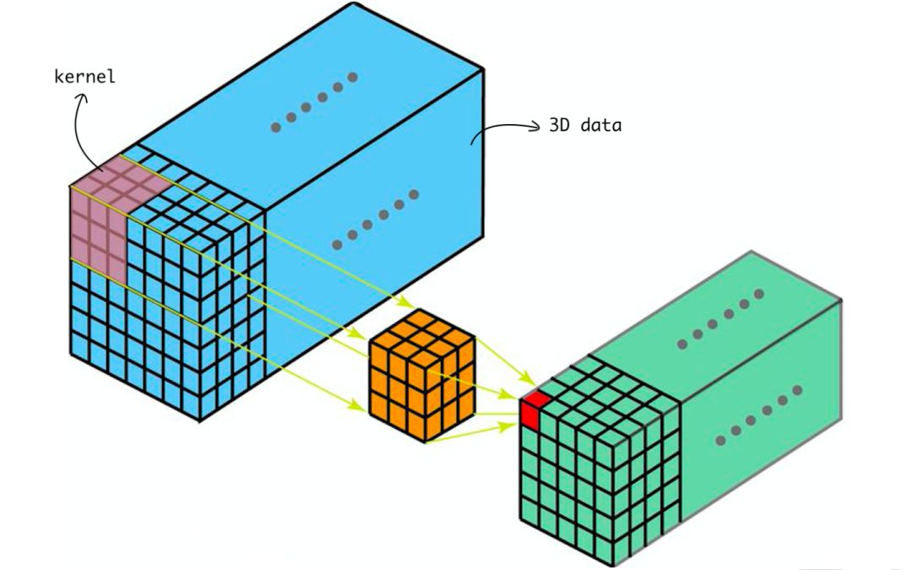
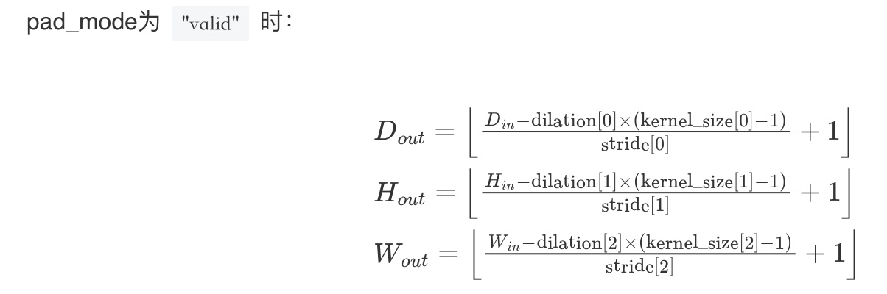

# mindspore.nn.Conv3d
**三维卷积**，通常应用于多帧场景（视频帧）, 与 mindspore.nn.Conv2d相比增加了一个维度（深度）。 
```python
class mindspore.nn.Conv3d(in_channels, out_channels, kernel_size, stride=1, pad_mode='same', padding=0, dilation=1, group=1, has_bias=False, weight_init=None, bias_init=None, data_format='NCDHW', dtype=mstype.float32)
```

## 输入和输出：
输入的Tensor尺寸为（${N}_{}$, ${C}_{in}$, ${D}_{in}$, ${H}_{in}$, ${W}_{in}$）。  
输出的Tensor尺寸为（${N}_{}$, ${C}_{out}$, ${D}_{out}$, ${H}_{out}$, ${W}_{out}$）。  
其中${N}_{}$为批尺寸，${C}_{}$为通道数，${D}_{}$, ${H}_{}$, ${W}_{}$分别为特征图的深度、高度和宽度。
输入和输出的${N}_{}$相等，${C}_{out}$ = 参数中的out_channels，${D}_{out}$, ${H}_{out}$, ${W}_{out}$的计算方法与参数中的pad_mode、padding相关，详见[mindspore官方文档](https://www.mindspore.cn/docs/zh-CN/master/api_python/nn/mindspore.nn.Conv3d.html)。

* 与mindspore.nn.Conv2d相比，输入和输出多了一个纬度深度D。

## 参数：
**in_channels** (int) - 输入Tensor的通道数。  
**out_channels** (int) - 输出Tensor的通道数。  
**kernel_size** (int or tuple[int]) - 卷积核的尺寸，int表示核的深度、高度和宽度均为该值，tuple的三个整数分别表示深度、高度和宽度。默认值为1。  
**stride** (int or tuple[int]，可选) - 卷积核的步长，int和tuple的含义同kernel_size，默认值为1。  
**pad_mode** (str，可选) - "same"，"valid" 或 "pad"三种模式 。默认值："same" 。  
**padding** (int or tuple[int]，可选) - 输入的深度、高度和宽度方向补充的层数。默认值： 0 （不填充）。  
**dilation** (int, tuple[int]，可选) - 卷积核膨胀尺寸。int和tuple的含义同kernel_size，默认值为1。  
**group** (int，可选) - 将过滤器拆分为组， in_channels 和 out_channels 必须可被 group 整除。默认值： 1 。  
**has_bias** (bool，可选) - 是否添加偏置参数。默认值： False 。  
**weight_init** (Tensor, str, Initializer or numbers.Number，可选) - 权重参数的初始化方法。详见[Initializer](https://www.mindspore.cn/docs/zh-CN/master/api_python/mindspore.common.initializer.html), 。默认值： None ，权重使用 "HeUniform" 初始化。  
**bias_init** (Tensor, str, Initializer or numbers.Number，可选) - 偏置参数的初始化方法。使用的初始化方法与 weight_init 相同。详见[Initializer](https://www.mindspore.cn/docs/zh-CN/master/api_python/mindspore.common.initializer.html)。默认值： None ，偏差使用 "Uniform" 初始化。  
**data_format** (str，可选) - 数据格式的可选值。目前仅支持 'NCDHW' 。  
**dtype** (mindspore.dtype) - 参数的dtype。默认值： mstype.float32 。  

更细节的参数介绍可参考[mindspore官方文档](https://www.mindspore.cn/docs/zh-CN/master/api_python/nn/mindspore.nn.Conv3d.html)。  

## 与torch.nn.Conv3d的参数差异对比：
1. padding与pad_mode的填充方式差异。  
2. bias的默认值差异.  
* 详见[比较与torch.nn.Conv3d的差异](https://www.mindspore.cn/docs/zh-CN/r2.1/note/api_mapping/pytorch_diff/Conv3d.html)

## 样例：
kernel在3维数据上滑动运算的示意图：  

    

### 用例1: 不含padding及bias
构造一个batch_size为1，input_channel为1的 4*4*4的三维张量，如下：   
[[[[[1, 2, 3, 4],  
&nbsp;&nbsp;&nbsp;&nbsp;&nbsp;&nbsp;[5, 6, 7, 8],  
&nbsp;&nbsp;&nbsp;&nbsp;&nbsp;&nbsp;[9, 10, 11, 12],  
&nbsp;&nbsp;&nbsp;&nbsp;&nbsp;&nbsp;[13, 14, 15, 16]],  

&nbsp;&nbsp;&nbsp;&nbsp;&nbsp;[[1, 2, 3, 4],  
&nbsp;&nbsp;&nbsp;&nbsp;&nbsp;&nbsp;[5, 6, 7, 8],  
&nbsp;&nbsp;&nbsp;&nbsp;&nbsp;&nbsp;[9, 10, 11, 12],  
&nbsp;&nbsp;&nbsp;&nbsp;&nbsp;&nbsp;[13, 14, 15, 16]],

&nbsp;&nbsp;&nbsp;&nbsp;&nbsp;[[1, 2, 3, 4],  
&nbsp;&nbsp;&nbsp;&nbsp;&nbsp;&nbsp;[5, 6, 7, 8],  
&nbsp;&nbsp;&nbsp;&nbsp;&nbsp;&nbsp;[9, 10, 11, 12],  
&nbsp;&nbsp;&nbsp;&nbsp;&nbsp;&nbsp;[13, 14, 15, 16]],

&nbsp;&nbsp;&nbsp;&nbsp;&nbsp;[[1, 2, 3, 4],  
&nbsp;&nbsp;&nbsp;&nbsp;&nbsp;&nbsp;[5, 6, 7, 8],  
&nbsp;&nbsp;&nbsp;&nbsp;&nbsp;&nbsp;[9, 10, 11, 12],  
&nbsp;&nbsp;&nbsp;&nbsp;&nbsp;&nbsp;[13, 14, 15, 16]]]]]

卷积核的尺寸为2*2*2，具体数据如下：  
 [[[[[1, 2]  
&nbsp;&nbsp;&nbsp;&nbsp;&nbsp;&nbsp;[3, 4]],  

&nbsp;&nbsp;&nbsp;&nbsp;&nbsp;[[1, 2]  
&nbsp;&nbsp;&nbsp;&nbsp;&nbsp;&nbsp;[3, 4]]]]]

将卷积核的值与目标区域的值相乘后相加，再将kernel滑动至下一个区域重复相乘后相加的运算，重复上述步骤直至计算完毕。得到一个3x3x3的张量：  
 [[[[[88, 108, 128],  
&nbsp;&nbsp;&nbsp;&nbsp;&nbsp;&nbsp;[168, 188, 208],  
&nbsp;&nbsp;&nbsp;&nbsp;&nbsp;&nbsp;[248, 268, 288]],

&nbsp;&nbsp;&nbsp;&nbsp;&nbsp;[[88, 108, 128],  
&nbsp;&nbsp;&nbsp;&nbsp;&nbsp;&nbsp;[168, 188, 208],  
&nbsp;&nbsp;&nbsp;&nbsp;&nbsp;&nbsp;[248, 268, 288]],

&nbsp;&nbsp;&nbsp;&nbsp;&nbsp;[[88, 108, 128],  
&nbsp;&nbsp;&nbsp;&nbsp;&nbsp;&nbsp;[168, 188, 208],  
&nbsp;&nbsp;&nbsp;&nbsp;&nbsp;&nbsp;[248, 268, 288]]]]]  

以output[0][0][0][0][0]举例：  
输入的计算范围是： [[[1, 2], [5, 6]], [[1, 2], [5, 6]]]  
卷积核为：[[[1, 2], [3, 4]], [[1, 2], [3, 4]]]  
output[0][0][0][0][0] =  1 * 2 + 2 * 2 + 5 * 3 + 6 * 4 + 1 * 2 + 2 * 2 + 5 * 3 + 6 * 4 = 88 
再将卷积核按照步长（默认为1）移动，直至计算出完整的输出。

输出的size可以套用[mindspore官方文档](https://www.mindspore.cn/docs/zh-CN/master/api_python/nn/mindspore.nn.Conv3d.html)中的公式得出：

   

${D}_{out}$ =（4 - 1 x (2 - 1)）/ 1 = 3  
${H}_{out}$ =（4 - 1 x (2 - 1)）/ 1 = 3
${W}_{out}$ =（4 - 1 x (2 - 1)）/ 1 = 3  

**代码演示如下：**
```python
import mindspore
from mindspore import Tensor
import mindspore.nn as nn
import numpy as np

# 输入的shape为（N，C，D，H，W）
x_ = np.ones((16, 3, 10, 32, 32)) 
x = Tensor(x_, mindspore.float32)

# nn.Conv3d前三个参数为必选项，且in_channels的值必须与输入的C相同
net = nn.Conv3d(in_channels=3, out_channels=32, kernel_size=(4, 3, 3), has_bias=True, pad_mode='valid') 

output = net(x)
output_shape = net(x).shape

print(output_shape)
# (16, 32, 7, 30, 30)
# N = 16：与输入的N相等，C = 32：与设置的out_channels参数相等。


import mindspore
from mindspore import Tensor, Parameter
import mindspore.nn as nn
import numpy as np

# 输入的shape为（N，C，D，H，W）
x =  Tensor([[[[[1, 2, 3, 4],
               [5, 6, 7, 8],
               [9, 10, 11, 12],
               [13, 14, 15, 16]], 

               [[1, 2, 3, 4],
               [5, 6, 7, 8],
               [9, 10, 11, 12],
               [13, 14, 15, 16]],

               [[1, 2, 3, 4],
               [5, 6, 7, 8],
               [9, 10, 11, 12],
               [13, 14, 15, 16]],

               [[1, 2, 3, 4],
               [5, 6, 7, 8],
               [9, 10, 11, 12],
               [13, 14, 15, 16]]]]], mindspore.float32)
               
# nn.Conv3d前三个参数为必选项，且in_channels的值必须与输入的C相同。pad_mode='valid'表示不做填充。
net = nn.Conv3d(in_channels=1, out_channels=1, kernel_size=(2, 2, 2), has_bias = False, pad_mode='valid') 
output = net(x)

print("weight:\n", net.weight.asnumpy())
# weight:
#  [[[[[ 0.08005141 -0.2528912 ]
#      [-0.03756215  0.14352521]]

#    [[-0.18712135  0.17283224]
#     [ 0.18411559 -0.03794528]]]]]
print("output:\n", output)
# output:
#  [[[[[1.0990589 1.1640635 1.2290678]
#     [1.3590766 1.4240812 1.4890858]
#     [1.6190945 1.6840993 1.7491034]]

#    [[1.0990589 1.1640635 1.2290678]
#     [1.3590766 1.4240812 1.4890858]
#     [1.6190945 1.6840993 1.7491034]]

#    [[1.0990589 1.1640635 1.2290678]
#     [1.3590766 1.4240812 1.4890858]
#     [1.6190945 1.6840993 1.7491034]]]]]
```


